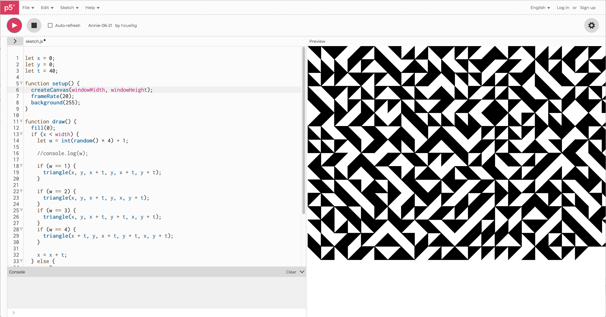
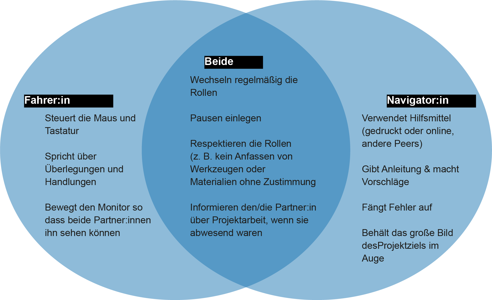
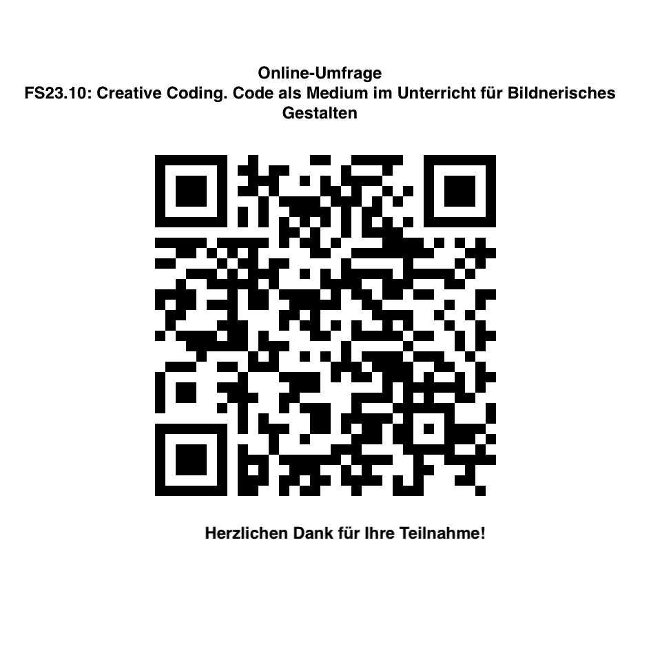

# Code als Medium im Unterricht für Bildnerisches Gestalten

## Herzlich Willkommen zur Weiterbildung am Mittwoch, 12. April 2023

## Programm Nachmittag
* Live Coding :fireworks:
* Wer bin ich? Eure Interessen? :question:
* Sequenz Coding Einführung :sparkler:
* Sequenz Coding selbständig :computer:
* Share :boom:
* Abschluss :wave:

*** 

## Live Coding Session :fireworks:
* https://teddavis.org/p5live/
* <a href="https://docs.google.com/spreadsheets/d/1FKqog9lBL44M4QvW2tRDSiCaI5YoMXTXvY1IGS8SJGk/edit?usp=sharing" target="_blank"> Austausch Links </a>

## Austausch Interesse Padlet  :question:
https://padlet.com/hannazuellig/interessen-coding-im-unterricht-nzejx0lb7hbb270q

## Sequenz Coding Annie :sparkler:
 <a href="CreativeCoding-SequenzFinal.pdf" target="_blank">Slides der Präsentation</a>

## Videotutorials :computer:
https://ha-ma-ct-21.netlify.app/videotutorials/

## Pair Programming 
Pair Programming (PP) ist eine Methode, bei der zwei Personen Seite an Seite arbeiten - und dabei jeweils die Rollen von 'Driver' und 'Navigator' tauschen. Die Fahrer:innen schreiben den Code, während die Navigator:innen Support und Inputs geben, nach Fehlern suchen und Ressourcen wie Referenzen hinzuziehen. Fahrer:in und Navigator:in wechseln die Rollen in einem zeitlichen Intervall. Die Partner:innen müssen lernen, wie man Design- und Programmierideen gemeinsam konstruiert und umsetzt, da die Fahrer diejenigen sind, die Maus und Tastatur berühren. 

## Variation und Transformation  :computer:
* https://br.pinterest.com/pin/542120873891789578/
* Truchet Tiles: https://en.wikipedia.org/wiki/Truchet_tiles
* Annie Albers Intepretation mit GUI https://editor.p5js.org/hzuellig/sketches/UJkpIp11H 

## Loops! :computer:
* https://thecodingtrain.com/tracks/code-programming-with-p5-js/code/4-loops/1-while-for
* https://thecodingtrain.com/tracks/code-programming-with-p5-js/code/4-loops/2-nested

## Share :boom:
https://miro.com/app/board/uXjVMVEuJW4=/?share_link_id=943024169109

## ZHDK Weiterbildung :wave: 
* https://www.zhdk.ch/weiterbildung/vermittlung-525/creative-coding-in-der-vermittlungspraxis-einsetzen-19230

****
## Auswertung
